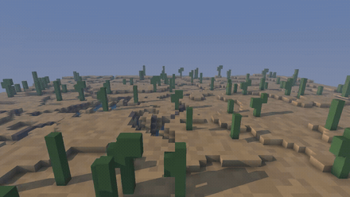

# llimphi

> Native UI framework — 2D **and** 3D: HAL · raster · layout · text · theme · ui · 3D voxel engine — plus widgets and modules.

`llimphi` is a sovereign, retained-mode UI framework with an Elm-style loop (`input → update → view → layout → raster → present`). Declarative pipeline over `vello` 0.7 + `wgpu` 27 + `taffy` + `parley` 0.6, with `Dark/Light/Aurora/Sunset/Tawa` themes and a multi-platform HAL (Wayland · X11 · Win32 · Android · Wawa bare-metal). It powers a full Rust application suite; this repository is the framework extracted to stand on its own.

<p align="center">
  
  <br>
  <sub>real widgets in motion — rendered headless, frame-by-frame, fully deterministic</sub>
</p>

<p align="center">
  
  <br>
  <sub>…and the entire Elm loop in ~124 LOC — <code>cargo run -p llimphi-ui --example counter</code></sub>
</p>

## Not just 2D — a 3D voxel engine

<p align="center">
  
  <br>
  <sub>a procedural voxel world orbiting — rendered headless by <code>llimphi-3d</code>, frame-by-frame</sub>
</p>

`llimphi-3d` is a **3D engine** on the same `wgpu`: it composes voxels (a GPU ray-march) and triangle meshes in one shared depth pass, with a keyframed cinema camera. It mounts into the ordinary 2D `View` tree through the GPU paint node (`set_viewport` + scissor), so a 3D viewport can live in a panel next to regular widgets — no second window, same Elm loop.

`llimphi-voxel` adds the *content* layer on top: procedural world-gen (`WorldRecipe`), articulated characters (age + animation clips) and a scripted scene **director**. The GIF above is one such world. (A full voxel **world studio** — edit worlds, cast characters, direct filmed scenes, export to video — is built on these in the wider project.)

**Usage manual:** [MANUAL.md](MANUAL.md) — full reference (Elm loop, `View<Msg>` DSL, the ~44 widgets and 10 modules, GPU path, gotchas) for humans and AI. Design rationale and roadmap: [SDD.md](SDD.md).

Philosophy: **widgets aren't designed against mockups; they're designed with what `vello` and `taffy` can do.**

## Quick start

```sh
git clone https://git.tawasuyu.net/tawasuyu/llimphi.git
cd llimphi
cargo run -p llimphi-ui --example counter   # ~124 LOC: the full Elm loop on screen
```

## Install

```toml
[dependencies]
llimphi-ui    = { git = "https://git.tawasuyu.net/tawasuyu/llimphi.git" }
llimphi-theme = { git = "https://git.tawasuyu.net/tawasuyu/llimphi.git" }
# widgets are one crate each — pull only what you use:
llimphi-widget-button = { git = "https://git.tawasuyu.net/tawasuyu/llimphi.git" }
```

## Compatibility

- **Linux/Wayland** — primary backend.
- **Linux/X11** — via XWayland.
- **macOS / Windows** — `winit` + `wgpu`.
- **Android** — HAL via `android` crates.
- **Wawa bare-metal** — alternative framebuffer HAL.

Crates listed in [README.md](README.md) (framework, widgets, modules, android).

## Considerations

- **Single API: declarative `View<Msg>`.** No imperative, no foreign vDOM.
- **Same scene tree on Wayland and Wawa**: HAL abstracts the surface.
- Widgets are **purely visual**; modules encapsulate state + behavior.
